# RDPRemote 架构文档

> 系统架构设计与技术细节

## 目录

- [系统概述](#系统概述)
- [架构设计](#架构设计)
- [数据流](#数据流)
- [核心模块](#核心模块)
- [协议设计](#协议设计)
- [性能优化](#性能优化)
- [安全设计](#安全设计)

---

## 系统概述

RDPRemote 是一个基于 WebRTC 的跨平台远程桌面控制系统，采用微服务架构设计，支持低延迟、高画质的远程桌面体验。

### 设计目标

| 目标 | 指标 |
|------|------|
| 端到端延迟 | < 100ms |
| 视频画质 | 1080p @ 30fps |
| 带宽占用 | 1-5 Mbps (自适应) |
| CPU 占用 | Agent < 15%, Client < 10% |
| 并发连接 | 单服务器 1000+ |

---

## 架构设计

### 系统架构图

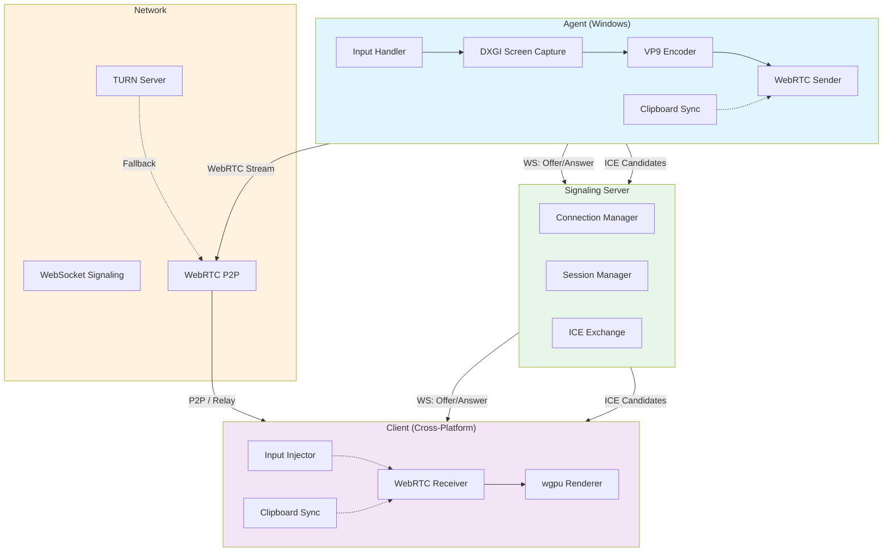

### 组件交互图

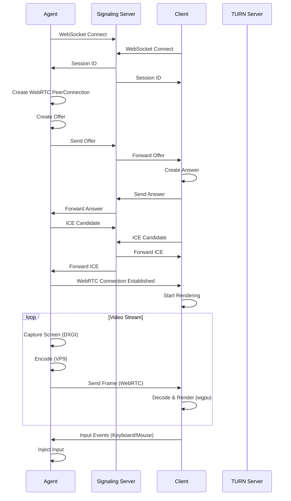

---

## 数据流

### 视频流管道

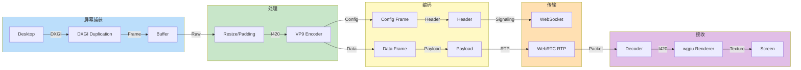

### 控制流管道

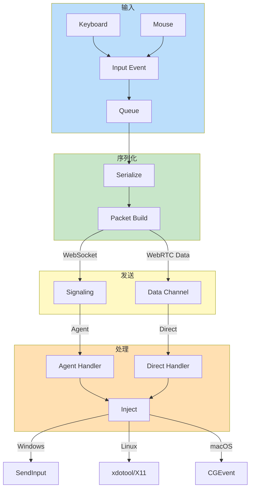

---

## 核心模块

### Agent 模块

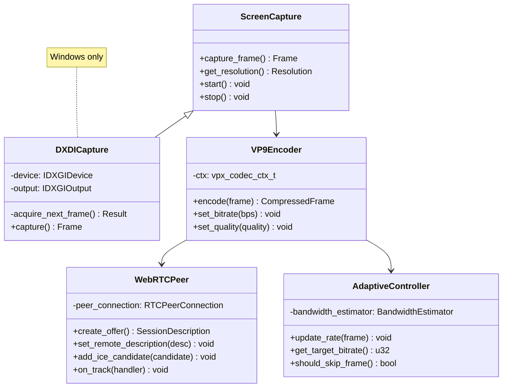

### Client 模块

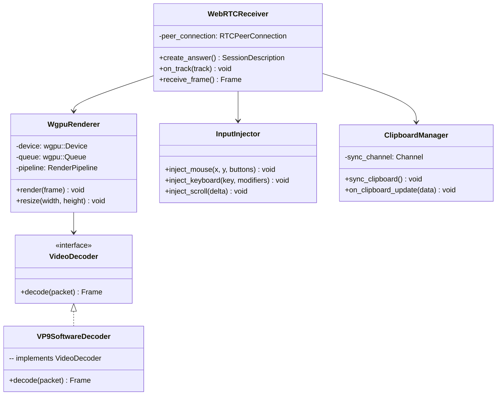

---

## 协议设计

### 信令消息协议

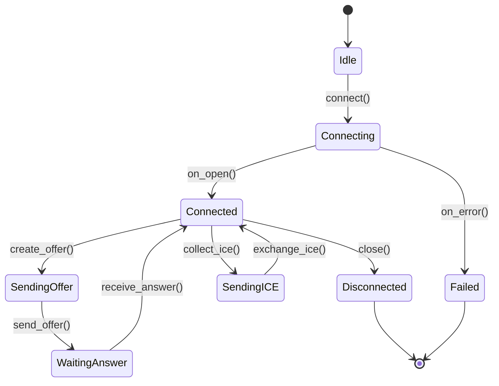

### SignalingMessage 定义

```rust
// common/src/signaling.rs

#[derive(Serialize, Deserialize, Debug)]
#[serde(tag = "type")]
pub enum SignalingMessage {
    // 连接管理
    Connect {
        agent_id: String,
    },

    // WebRTC 信令
    Offer {
        sdp: String,
    },

    Answer {
        sdp: String,
    },

    IceCandidate {
        candidate: String,
        sdp_mline_index: u32,
        sdp_mid: String,
    },

    // 会话控制
    Ready,
    Start,
    Stop,

    // 错误处理
    Error {
        code: ErrorCode,
        message: String,
    },
}
```

### 视频帧协议

```mermaid
flowchart LR
    subgraph Header["Frame Header (16 bytes)"]
        H1[Magic: 0x52445046]
        H2[Version: u8]
        H3[Flags: u8]
        H4[Width: u16]
        H5[Height: u16]
        H6[Timestamp: u64]
        H7[FrameType: u8]
        H8[PayloadLen: u32]
    end

    subgraph Payload["VP9 Payload"]
        P1[VP9 Frame Data]
    end

    Header --> Payload

    note right of Header
        - I-Frame: Key frame
        - P-Frame: Predictive frame
        - ROI: Region of interest
    end note
```

---

## 性能优化

### 带宽自适应

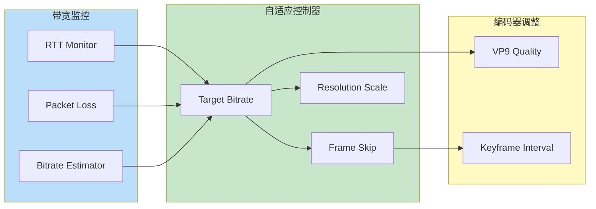

### ROI 区域优化

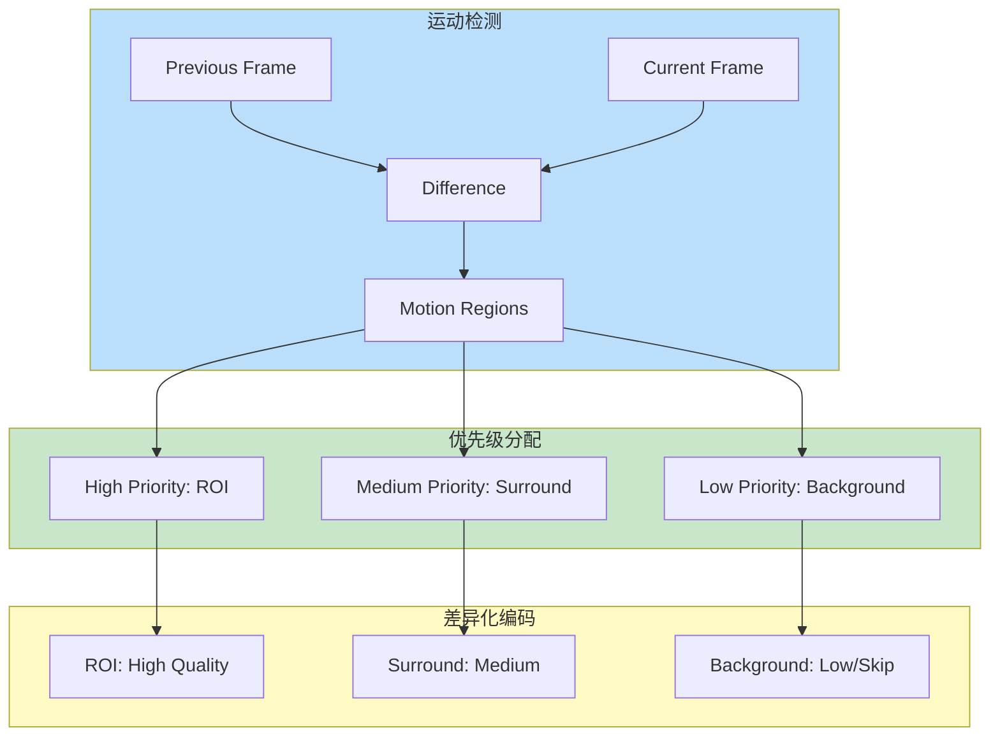

---

## 安全设计

### 安全架构

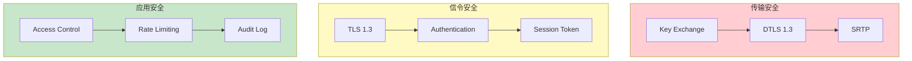

### 认证流程

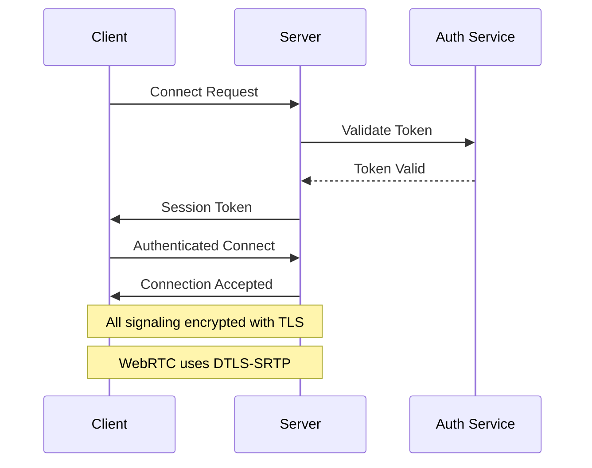

---

## 技术栈

| 组件 | 技术 | 说明 |
|------|------|------|
| 运行时 | Rust 1.75+ | 内存安全、高性能 |
| 异步框架 | tokio | 异步 I/O |
| WebRTC | webrtc-rs | P2P 通信 |
| 视频编码 | libvpx | VP9 编码 |
| 屏幕捕获 | DXGI | Windows 桌面复制 |
| 图形渲染 | wgpu | 跨平台 GPU 渲染 |
| 序列化 | serde | 高效序列化 |
| 日志 | tracing | 结构化日志 |

---

## 扩展性设计

### 水平扩展

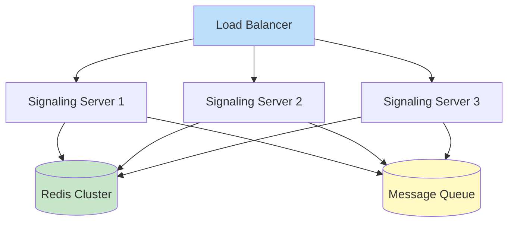

### 插件架构

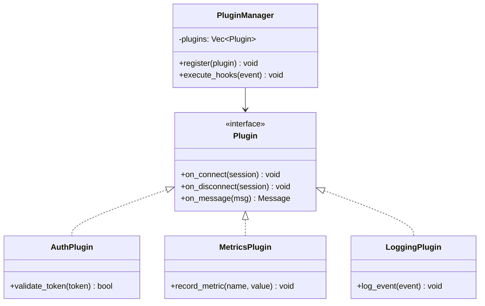

---

*最后更新: 2026-05-30*